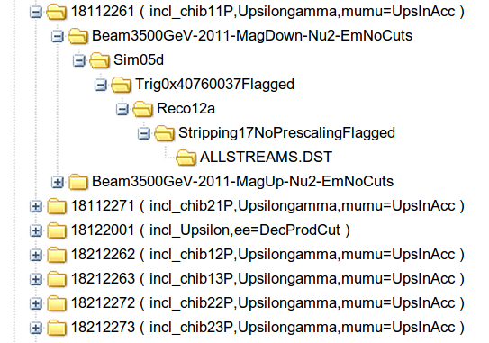

.. include:: beamer.defs

================================
Python White Magic
================================

Simulated MC events
===================

|column1|

|column2|

* 6 event types :math:`\chi_{b_{1,2}}(1,2,3P)`.
* For each type: 500K(MagUp) + 500K(MagDown) events

|end_columns|

Mass difference for unmatched events
====================================

.. image:: figs/mc_unmatched.eps
   :scale: 50%
   :align: center

|alert<| |>|
The same shape as on data
|end_alert|

Matched events
====================================
|column1|

.. image:: figs/mc_chib11p.eps
   :scale: 24%
   :align: center

.. image:: figs/mc_chib12p.eps
   :scale: 24%
   :align: center

.. image:: figs/mc_chib13p.eps
   :scale: 24%
   :align: center

|column2|

.. image:: figs/mc_chib21p.eps
   :scale: 24%
   :align: center

.. image:: figs/mc_chib22p.eps
   :scale: 24%
   :align: center

.. image:: figs/mc_chib23p.eps
   :scale: 24%
   :align: center

|end_columns|

pT(Upsilon) distribution
====================================
.. image:: figs/mc_pt_g.pdf
   :scale: 50%
   :align: center

