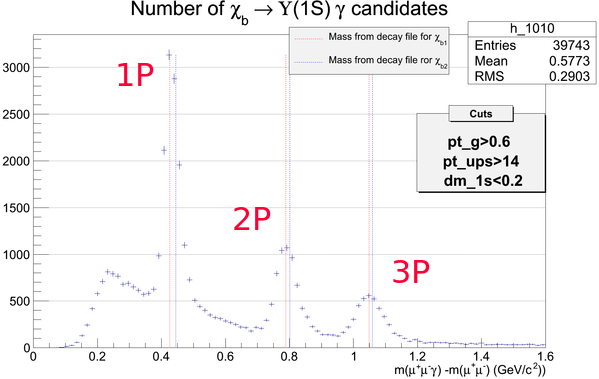
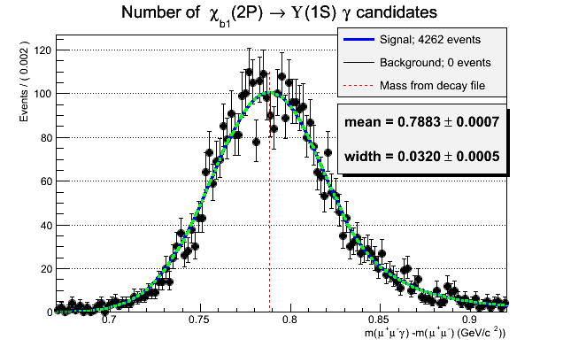

.. include:: beamer.defs

================================
Chi_b Monte-Carlo Study
================================

Simulated MC events
===================

|column1|

|column2|

* 6 event types :math:`\chi_{b_{1,2}}(1,2,3P)`.
* For each type: 500K(MagUp) + 500K(MagDown) events

|end_columns|

Study MC vs. Data
====================================

* Compare yield's width
* Check distribution of main cut's parameters

MC Unmatched Events
====================================

MC Matched Events
====================================
|column1|

|column2|

|end_columns|

Data Fit
====================================

Width Comparison
======================

.. raw:: latex
   
   {\small
   \begin{center}
   \begin{tabular}{c||c|c|c}
   & \textbf{$\sigma_{MC_{matched}}$} & \textbf{$\sigma_{MC_{unmatched}}$} & $\sigma_{data}$ \\
   \hline
   \hline
   $\chi_{b1}(1P)$ & $0.0208 \pm 0.0003$ & \multirow{2}{*}{ $0.0233 \pm 0.0004$ } &\multirow{2}{*}{ $0.0264 \pm 0.0013$ }\\
   $\chi_{b2}(1P)$ & $0.0213 \pm 0.0007$ & & \\
   \hline
   $\chi_{b1}(2P)$ & $0.0320 \pm 0.0005$ & \multirow{2}{*}{ $0.0330 \pm 0.0003$ } & \multirow{2}{*}{$0.0377 \pm 0.0046$}\\
   $\chi_{b2}(2P)$ & $0.0354 \pm 0.0012$ & & \\
   \hline
   $\chi_{b1}(3P)$ & $0.0419 \pm 0.0008$ & \multirow{2}{*}{ $0.0417 \pm 0.0011$ } & \multirow{2}{*}{$0.0475 \pm 0.0120$}\\
   $\chi_{b2}(3P)$ & $0.0426 \pm 0.0016$ & &\\
   \hline
   \end{tabular}
   \end{center}
   }

pT(gamma) Distribution (1)
==========================

pT(gamma) Distribution (2)
==========================

|column1|

|column2|

|end_columns|

pT(Upsilon) Distribution
=============================

|column1|

|column2|

|end_columns|

pT(chib) Distribution
=============================

|column1|

|column2|

|end_columns|

pT(Upsilon) spectrum
============================

|column1|

* MC

|column2|

* Data

.. image:: figs/spectrptups.png
   :scale: 28%
   :align: center

|end_columns|

Conclusion
==========

* Good yield's width. Will try to improve cut function using MC information.
* Need to check other fit parameter's distribution.
